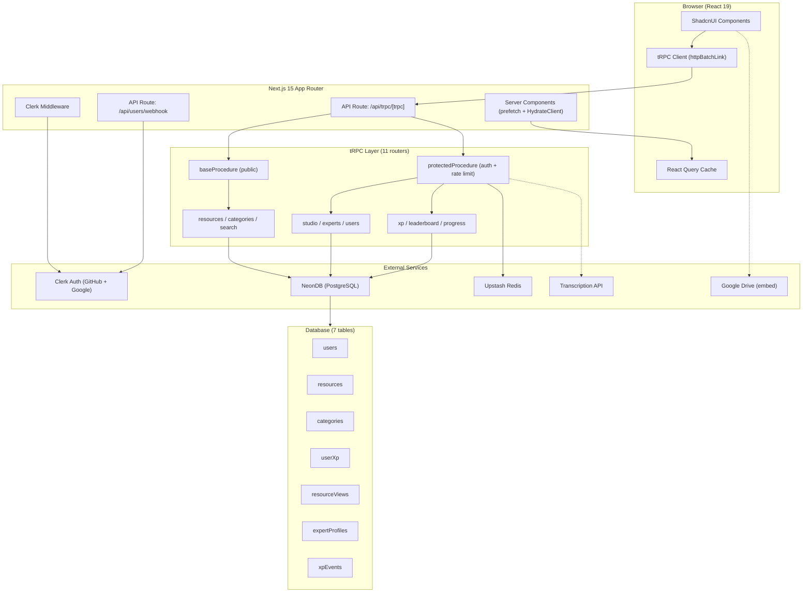

# Architecture

## System Overview

Hyvmind is a fullstack Next.js 15 application using the App Router. It follows a domain-driven module architecture with tRPC for type-safe API calls, Drizzle ORM for database access, Clerk for authentication, and Upstash Redis for rate limiting.



## Major Components

### 1. Frontend Layer

- **React 19** with server components for SSR data prefetching
- **ShadcnUI + Radix UI** for accessible component primitives (30+ components)
- **Tailwind CSS v4** with Pattern brand design system (dark-first)
- **React Query** for client-side caching and polling
- **React Hook Form + Zod** for form validation

### 2. API Layer (tRPC)

9 domain routers registered in `src/trpc/routers/_app.ts`:

| Router | Auth | Purpose |
|--------|------|---------|
| `resources` | Mixed | CRUD, search, transcription, publish |
| `categories` | Public | Category listing |
| `search` | Public | Full-text search across resources |
| `studio` | Protected | User's own resource management |
| `experts` | Mixed | Expert profiles with team filtering |
| `users` | Protected | Profile management |
| `xp` | Protected | XP tracking, view recording |
| `leaderboard` | Public read | Ranked user listings |
| `progress` | Protected | View history, completion tracking |

### 3. Authentication

- **Clerk** handles sign-in/sign-up (GitHub + Google OAuth)
- **Middleware** (`src/middleware.ts`) protects `/studio`, `/settings`, `/progress` routes
- **Auto user creation**: `protectedProcedure` auto-creates DB user on first tRPC request from a new Clerk user
- **Webhook** (`/api/users/webhook`) syncs Clerk user events to DB

### 4. Database

- **NeonDB** (serverless PostgreSQL) via HTTP driver
- **Drizzle ORM** for schema, queries, and migrations
- 7 tables with cascading deletes and foreign key constraints
- Cursor-based pagination pattern: `{ id, updatedAt }` cursor for efficient infinite scroll

### 5. Caching & Rate Limiting

- **Upstash Redis** for sliding window rate limiting
- General: 20 requests per 10 seconds per user
- Submissions: 5 per hour (defined but not yet wired to contribute flow)

### 6. AI Transcription Pipeline

- External API called during the Contribute flow (Step 2)
- Accepts Google Drive URL, returns structured JSON (title, summary, steps, tags)
- Runs as fire-and-forget background process after draft creation
- Results stored in 6 transcription columns on the `resources` table
- Client polls `getTranscriptionStatus` every 3 seconds until complete or failed

## Data Flow: Resource Submission

```
User fills Step 1 (title, URL, type)
  → createDraft mutation
    → INSERT resource (isPublished: false, transcriptionStatus: "processing")
    → triggerTranscription() fire-and-forget
      → POST to external API
      → UPDATE resource transcription fields on success/failure

User fills Step 2 (category, description)
  → Client polls getTranscriptionStatus every 3s

User reviews Step 3 (preview + transcription cards)
  → publishResource mutation
    → UPDATE resource (isPublished: true)
    → Award +25 XP (INSERT xpEvent, UPDATE userXp)

Step 4: Confirmation + XP toast
```

## Route Groups

| Group | Path | Auth | Shell |
|-------|------|------|-------|
| `(auth)` | `/sign-in`, `/sign-up` | No | Centered layout |
| `(home)` | `/`, `/explore`, `/experts`, `/leaderboard`, `/resources/*` | Optional | Sidebar + topbar |
| `(studio)` | `/studio/*` | Required | Studio sidebar + navbar |

## Key Architectural Decisions

1. **Forked YouTube clone** — Kept tRPC + Drizzle + Clerk + ShadcnUI stack; stripped Mux video player + UploadThing
2. **Auto user creation in protectedProcedure** — Eliminates webhook dependency for user sync; Clerk API is authoritative
3. **Cursor-based pagination** — `{id, updatedAt}` cursor for deterministic, efficient infinite scroll
4. **Fire-and-forget transcription** — Non-blocking; resource creation returns immediately; client polls for result
5. **Domain-driven modules** — Each feature is self-contained: `server/procedures.ts` + `ui/` components
6. **Dark-first design** — Pattern brand system with CSS variables; `#090A0F` background, `#009BFF` primary
7. **Google Drive embed** — URL pattern matching extracts file ID for iframe embed; no video hosting needed
