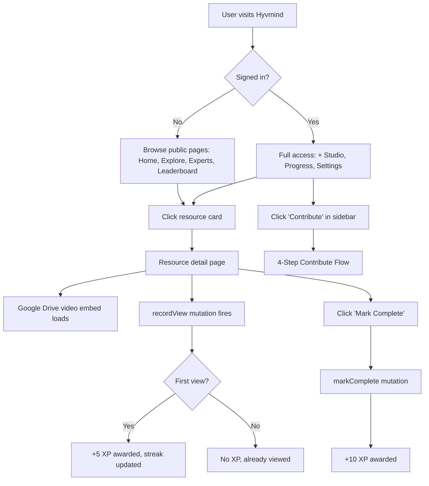
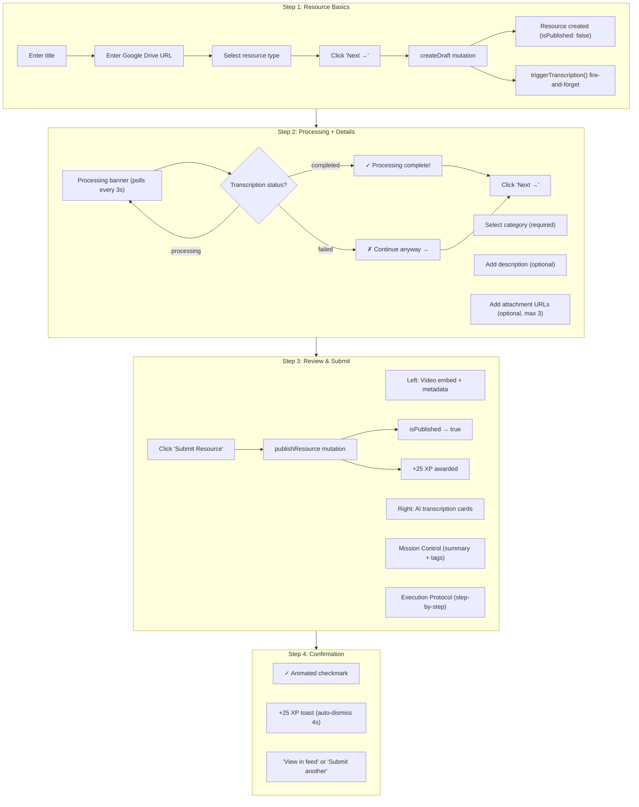
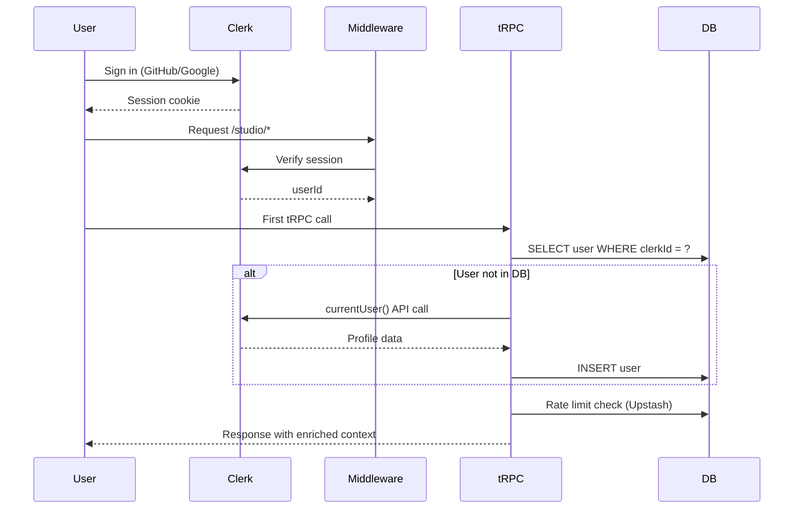

# Project Flow

## Primary Flow: Resource Discovery & Learning



## Contribute Flow (4-Step Stepper)



## Authentication Flow



## XP & Leveling Flow

| Action | XP | Trigger |
|--------|-----|---------|
| View a resource (first time) | +5 | `xp.recordView` / `progress.recordView` |
| Complete a resource | +10 | `progress.markComplete` |
| Submit a resource | +25 | `resources.publishResource` |
| First-ever submission | +50 | Not yet wired |
| Daily streak | +15 | Calculated on view recording |

**Levels:** Learner (0) → Explorer (100) → Builder (300) → Expert (600) → PAIoneer (1000)

## Data Fetching Pattern

```
Server Component (page.tsx)
  └─ prefetch(trpc.*.queryOptions(...))
  └─ return <HydrateClient><ClientView /></HydrateClient>

Client Component (client.tsx)
  └─ const trpc = useTRPC()
  └─ useSuspenseQuery(trpc.*.queryOptions(...))  // reads from hydrated cache
  └─ useSuspenseInfiniteQuery(...)               // for paginated lists
```

## Error States

| Scenario | Behavior |
|----------|----------|
| Unauthenticated user hits protected route | Clerk redirects to `/sign-in` |
| Rate limit exceeded (20 req/10s) | tRPC returns `TOO_MANY_REQUESTS` |
| Transcription API fails | Status set to "failed", user can continue without AI summary |
| Transcription API not configured | Same graceful degradation — "failed" status |
| Resource not found | tRPC returns `NOT_FOUND` error |
| Draft creation fails | Step 1 shows error message, user can retry |
| Publish fails | Step 3 shows error message, user can retry |

## Search Flow

```
User types in search bar
  → search.query procedure
  → ILIKE on resources.title + resources.description
  → Optional filters: type (enum), categoryId (UUID)
  → Ordered by viewCount DESC
  → Results rendered as resource cards
```

## Infinite Scroll (Home Feed / Explore)

```
Initial load: getMany({ limit: 12, categoryId: null })
  → Returns { items: Resource[], nextCursor: { id, updatedAt } | null }

User scrolls to bottom (IntersectionObserver triggers):
  → getMany({ limit: 12, cursor: lastCursor, categoryId: selectedCategory })
  → Appends items to list
  → Repeats until nextCursor is null
```
